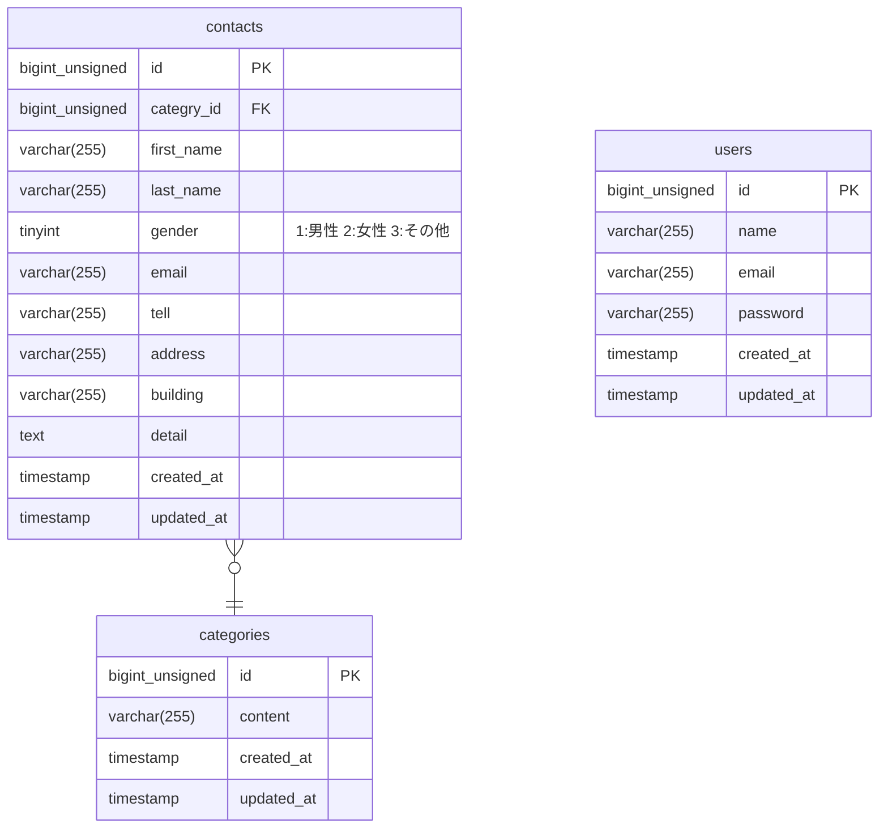

# お問い合わせフォーム

## 環境構築

### Dockerビルド
1. ```git clone https://github.com/itoro967/FashionablyLate-app.git```
1. ```cd FashionablyLate-app```
1. ```sudo docker-compose up -d --build```
### Laravel環境構築
1. ```sudo docker-compose exec php bash```
1. ```composer install```
1. ```cp .env.example .env``` ※動作しない場合は環境に応じて書き換えてください。
1. ```php artisan key:generate```
1. ```php artisan migrate```
1. ```php artisan db:seed ```
1. 完了

※http://localhost/ にアクセスした際にPermissionエラーが出る場合は下記を実行
```chmod -R 777 .```
## 使用技術(実行環境)
- PHP 8.2-fpm
- Laravel 11.26.0
- nginx 1.27.2
- mysql 9.0.1
## ER図

## URL
- 開発環境 http://localhost/